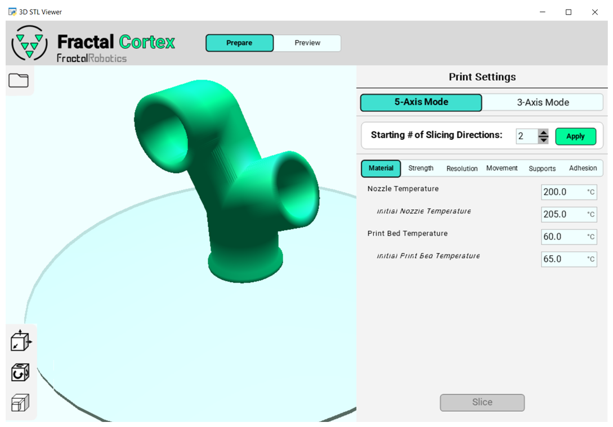
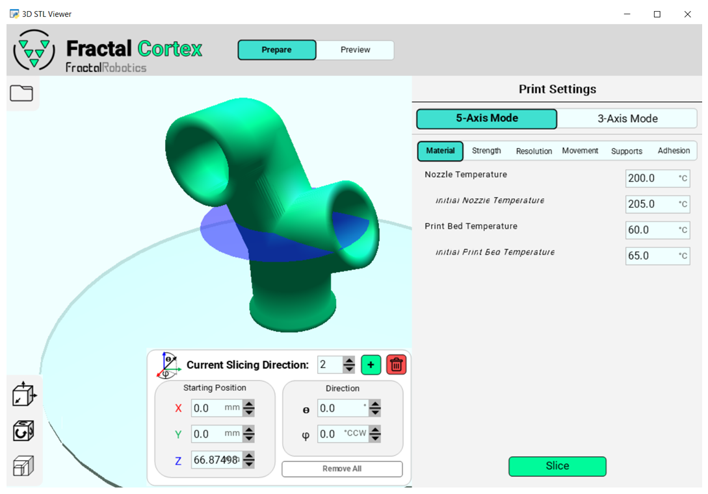
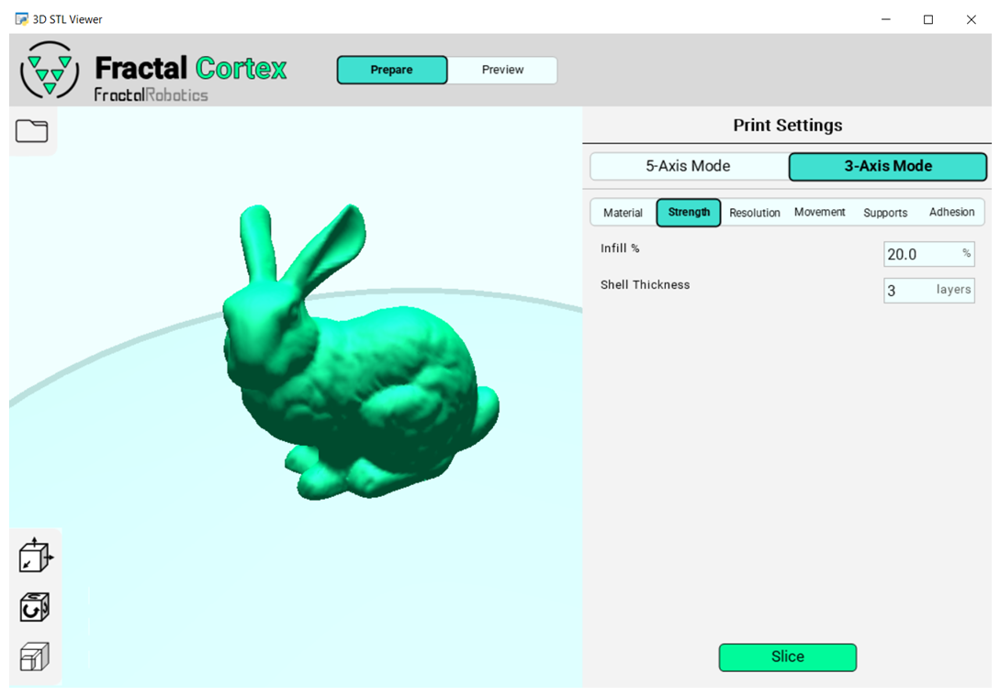

# Fractal Cortex

[](https://opensource.org/licenses/MIT)
[](https://www.python.org/)
[]()


Fractal Cortex 是由 **Fractal Robotics** 开发的开源多方向 5 轴 FDM 切片器，同时向后兼容传统 3 轴切片工作流。

- **配套硬件**: 开源 5 轴桌面级 3D 打印机 - [Fractal 5 Pro](https://github.com/fractalrobotics/Fractal-5-Pro)

<p align="center">
  
</p>

## 📋 目录

- [✨ 功能特性](#-功能特性)
- [💻 系统要求](#-系统要求)
- [🚀 快速开始](#-快速开始)
- [📘 使用指南](#-使用指南)
- [🏗️ 项目结构](#️-项目结构)
- [🎯 项目动机](#-项目动机)
- [🔍 产品-市场契合](#-产品-市场契合)
- [🤝 贡献指南](#-贡献指南)
- [📝 后续工作](#-后续工作)
- [⚖️ 许可证](#️-许可证)
- [🙏 致谢](#-致谢)
- [📞 联系方式](#-联系方式)

## ✨ 功能特性

- **🔄 多方向 5 轴切片**: 将 3D 模型分为多个体积块，每个块采用独立切片方向
- **🔧 向后兼容**: 无缝支持传统 3 轴切片工作流
- **🛡️ 碰撞避免**: 自动路径规划，防止喷嘴与工件碰撞
- **🎨 直观界面**: 用户友好的界面，支持模型操作和切片参数配置
- **📊 实时预览**: 生成 G-code 前可视化 5 轴刀具路径
- **⚡ 性能优化**: 并行处理以提高计算效率

## 💻 系统要求

| 组件 | 要求 |
|------|------|
| **操作系统** | Windows 10（其他平台可自行尝试） |
| **Python** | 3.10.11 |
| **内存** | 4GB RAM 最低要求，8GB 推荐 |
| **存储空间** | 2GB 可用空间 |

### 依赖库
- glooey 0.3.6
- numpy 1.26.4
- numpy-stl 3.1.1
- pyglet 1.5.28
- PyOpenGL 3.1.0
- shapely 2.0.4
- trimesh 4.3.1

### 安装方法
```bash
# 克隆仓库
git clone https://github.com/fractalrobotics/Fractal-Cortex.git
cd Fractal-Cortex

# 安装依赖
pip install glooey==0.3.6 numpy==1.26.4 numpy-stl==3.1.1 pyglet==1.5.28 PyOpenGL==3.1.0 shapely==2.0.4 trimesh==4.3.1

# 或者如果有 requirements.txt 文件
pip install -r requirements.txt
```

## 🚀 快速开始

1. **启动应用程序**
   ```bash
   # 进入 fractal-cortex 目录
   cd fractal-cortex

   # 运行主切片器
   python slicer_main.py
   ```

2. **加载模型**
   - 点击左上角文件图标选择一个或多个 STL 文件
   - 在视窗中可选中模型进行平移/旋转/缩放（支持多选：CTRL 或 CTRL+A，全选后可 ESC 取消）
   - 支持撤销操作（CTRL+Z）

3. **选择切片模式**
   - **5 轴模式**: 高级多方向切片
   - **3 轴模式**: 传统 FDM 切片（向后兼容）

4. **配置参数**
   - 设置切片方向（5 轴模式）
   - 调整打印设置（温度、层高、速度等）
   - 配置材料和打印选项

5. **切片并导出**
   - 点击 "Slice" 开始切片
   - 在 "Preview" 模式下预览刀具路径
   - 保存 G-code 文件

> 💡 **提示**: 从附带的示例文件 `examples/pipe_fitting.stl` 开始熟悉界面。

## 📘 使用指南

Fractal Cortex 是一种"多方向 5 轴"FDM 切片方案：将 3D 模型划分为多个子体积（chunk），并对每个子体积采用不同的切片方向。与"非平面切片"不同，Fractal Cortex 更关注通过多方向分块来减少支撑使用，并保持易用性。

### 多方向 5 轴切片技术说明

- **模型分割**: 将模型分割为多个方向一致的小体积，每个体积采用独立的切片平面与方向
- **G-code 生成**: 切片完成后导出的 G-code 会在各体积之间插入相对喷头/工件的重新定向指令
- **技术优势**: 与非平面切片（每层表面曲线化）相比，多方向切片更强调"方向分块"，以此降低支撑需求、兼顾易学易用

> 📚 **技术说明**: 这种方法在传统 3 轴局限性与复杂 5 轴系统的高门槛之间架起桥梁，在不增加学习成本的情况下减少支撑需求。

<p align="center">
  
</p>

### 5 轴模式
1. 右键 `slicer_main.py`，选择 “Edit with IDLE 3.10 (64 Bit)” 打开后按 F5 运行；窗口中默认选中 “5-Axis Mode”。

<p align="center">
  
</p>

2. 点击左上角文件图标选择一个或多个 STL；在视窗中可选中模型进行平移/旋转/缩放（支持多选：CTRL 或 CTRL+A，全选后可 ESC 取消）。支持撤销（CTRL+Z）。

<p align="center">
  
</p>

3. 在右侧打印设置中指定初始“切片方向数量”。注意最小为 2（第一方向固定为与平台法向一致）。点击 Apply 后，可见蓝色切片平面与“Current Slicing Direction”菜单。

<p align="center">
  
</p>

4. 使用该菜单中的 5 个输入框，调整当前切片平面的“位置与方向（θ/φ）”。

<p align="center">
  
</p>

5. 使用 `+` 添加新平面、垃圾桶删除当前平面、或清空以回到步骤 3 的初始状态。

<p align="center">
  
</p>

6. 设置常规打印参数（喷嘴温度、层高、速度、回抽等），点击 Slice 开始切片。

   - 提醒：若检测到某切片平面可能导致“喷嘴与打印床”碰撞，切片将终止，并将该平面标红；请调整为合法位置后重试。
   - 不必担心“喷嘴与在制件”的碰撞：算法会安全排序切片方向，保证路径规划中避免自碰。

7. 切片完成后，点击顶部 “Preview” 可查看 5 轴路径预览（图示为加粗层线以强调方向变化），并可另存 G-code。

<p align="center">
  
</p>

### 3 轴模式
1. 进入 “3-Axis Mode”，选择 STL，按常规 3 轴切片的方式设置参数并切片。

<p align="center">
  
</p>

2. 切片完成后进入 “Preview” 预览并保存 G-code。

<p align="center">
  
</p>

## 🏗️ 项目结构

```
Fractal-Cortex/
├── 📁 fractal-cortex/          # 主应用程序目录
│   ├── slicer_main.py          # 主应用程序入口和GUI
│   ├── slicing_functions.py    # 核心切片算法和几何操作
│   ├── widget_functions.py     # GUI 组件定义和事件处理器
│   ├── fractal_widgets.py      # 自定义组件
│   ├── 📁 image_resources/     # GUI 图片和图标
│   │   ├── apply_Button_Images/
│   │   ├── CheckBox_Images/
│   │   ├── File_Button_Images/
│   │   └── ... (其他 UI 组件)
│   ├── Roboto-Regular.ttf      # GUI 字体文件
│   ├── slicer_main.spec        # PyInstaller 配置文件
│   ├── 📁 build/              # 构建产物（自动生成）
│   └── 📁 dist/               # 分发文件（自动生成）
├── 📁 examples/                # 示例文件和文档图片
│   ├── pipe_fitting.stl        # 示例 3D 模型
│   ├── *.PNG                   # 截图和文档图片
│   └── example_5_axis_gcode_for_pipe_fitting.gcode
├── 📄 .gitignore               # Git 忽略规则
├── 📄 LICENSE                  # MIT 许可证
├── 📄 README.md                # 本文件（中文版）
└── 📄 README_zh.md             # 文档（如果有英文版）
```

### 核心文件说明

- **`slicer_main.py`**: 主应用程序，包含 GUI、模型加载和切片编排
- **`slicing_functions.py`**: 数学算法，包含 3D 几何操作、网格处理和 G-code 生成
- **`widget_functions.py`**: GUI 交互处理器和组件管理
- **`fractal_widgets.py`**: 基于 PyGlet 的自定义 UI 组件

## 🎯 项目动机

本项目源于 **Fractal Robotics** 的愿景：**加速机械解决方案的开发**。Fractal Cortex 致力于在"3 轴 FDM 的局限"与"现有 5 轴 FDM 的门槛"之间架起桥梁。

### 问题空间分析

- **3 轴 FDM 的局限性**
  - 悬垂结构需要支撑；去除支撑常会损伤工件，且浪费材料、增加时间
  - 层状沉积导致层间抗剪弱、方向性强
- **现有 5 轴 FDM 的高门槛**
  - 非平面切片与高级 CAM 软件相关，学习成本高
  - 商用 5 轴打印机体积大、成本高
- **折中方案：多方向 5 轴**
  - 以"方向分块"显著降低支撑需求，同时保留类 3 轴的操作体验
  - 机械方面无需细长喷头，易实现更高速度与更少振动

最终形成两部分互补成果：Fractal Cortex 切片器与 [Fractal 5 Pro](https://github.com/fractalrobotics/Fractal-5-Pro) 打印机。

---

## 🔍 产品-市场契合

通过访谈收集需求、预算与期望，并转化为设计决策：

### 关键需求与技术解决方案映射

| 用户需求 | 技术解决方案 |
|----------|-------------|
| **减少后处理风险/材料浪费** | ➡️ 5 轴功能 |
| **易维护、整洁** | ➡️ FDM、可拆装热床、全尺寸门 |
| **降低培训成本** | ➡️ 直观的多方向切片、向后兼容 3 轴 |
| **复杂几何可打印** | ➡️ 适配任意 3D 几何 |
| **高可靠性** | ➡️ CoreXY 运动学、自动调平、刚性型材 |
| **材料兼容性广** | ➡️ 直驱挤出、加热平台、全封闭结构 |
| **大构建体积** | ➡️ φ300mm × 250mm 高度 |

## 🤝 贡献指南

我们欢迎社区贡献！以下是参与项目的方式：

### 开发环境设置
1. Fork 本仓库
2. 克隆你的 fork：`git clone https://github.com/your-username/Fractal-Cortex.git`
3. 创建特性分支：`git checkout -b feature/amazing-feature`
4. 安装依赖：`pip install -r requirements.txt`

### 代码贡献
1. 确保你的代码符合项目的编码风格
2. 为新功能编写测试
3. 更新文档
4. 提交 Pull Request

### 报告问题
- 使用 GitHub Issues 报告 bug
- 提供详细的复现步骤
- 包含相关的错误信息和日志

### 改进建议
- 功能请求请使用 GitHub Discussions
- 重大更改请先创建 Issue 讨论

---

## 📝 后续工作

当前版本可用，但要成为更稳健的产品还需要改进：

### 🔴 高优先级任务
- **复杂几何切片中断**: 需要在 `slicing_functions.py` 中增强错误处理
- **稳定性改进**: 修复已知的边界情况和错误

### 🟡 中优先级任务
- **性能优化**: 提升整体计算效率（已做并行化，仍有优化空间）
- **用户体验**: 改进界面响应速度和用户反馈

### 🟢 功能增强
- **支撑生成功能**: 增加 3/5 轴的支撑生成功能
- **更多导出格式**: 支持更多 G-code 变体
- **批处理**: 支持批量处理多个文件

### 📚 文档改进
- **API 文档**: 为核心函数添加详细文档
- **教程**: 创建更多使用案例和教程
- **故障排除**: 完善常见问题解答

若发现问题或有改进建议，欢迎通过以下方式反馈：
- 📧 邮箱：dan@fractalrobotics.com
- 🐛 GitHub Issues：[报告问题](https://github.com/fractalrobotics/Fractal-Cortex/issues)
- 💬 Discussions：[讨论交流](https://github.com/fractalrobotics/Fractal-Cortex/discussions)

## ⚖️ 许可证

本项目采用 MIT 许可证 - 查看 [LICENSE](LICENSE) 文件了解详情。

---

## 🙏 致谢

- **家人与朋友** - 提供持续的支持和鼓励
- **Innovate Newport** - 创业加速器支持
- **RISBDC** - 商业发展咨询
- **RIHUB** - 创业资源
- **罗德岛创业社区** - 宝贵反馈和支持

## 📞 联系方式

- 👨‍💼 **Dan Brogan** - 项目创建者
- 💼 LinkedIn: [Dan Brogan](https://www.linkedin.com/in/dan-brogan-442b27128/)
- 📧 邮箱: dan@fractalrobotics.com
- 🏢 Fractal Robotics 官网: [www.fractalrobotics.com](https://www.fractalrobotics.com)

---

## ⚠️ 免责声明

Fractal Cortex 以开源形式"按现状"提供，不附带任何担保。使用、修改或分发本软件所产生的一切后果（包括潜在的缺陷、数据丢失或硬件问题）由使用者自行承担。

**使用须知**: 本软件仍在开发中，请在生产环境使用前进行充分测试。

---

Copyright (C) 2025 Daniel Brogan