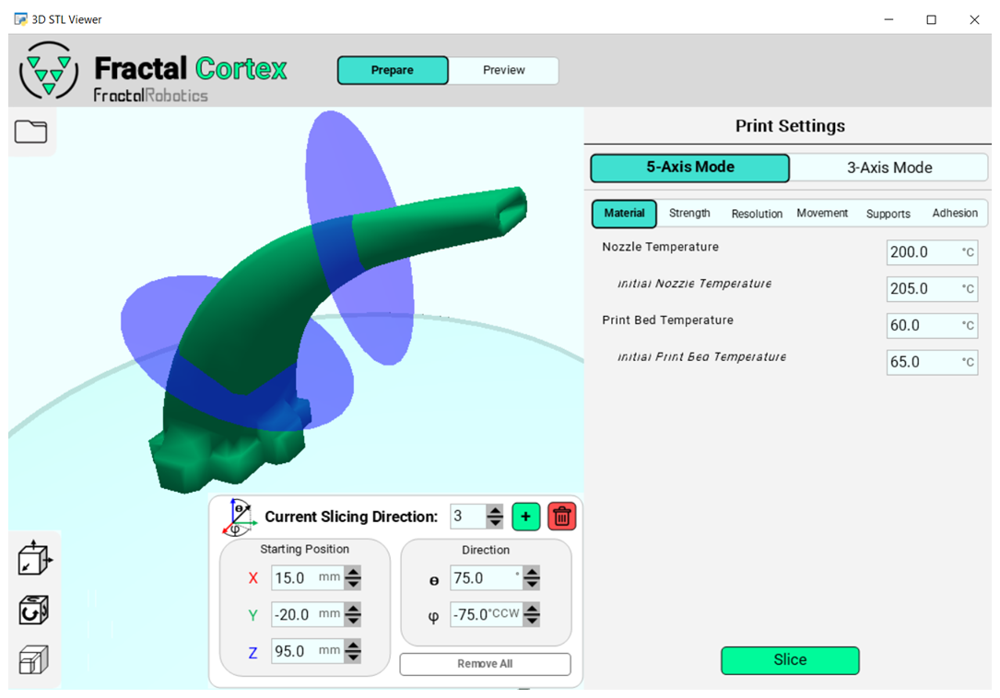
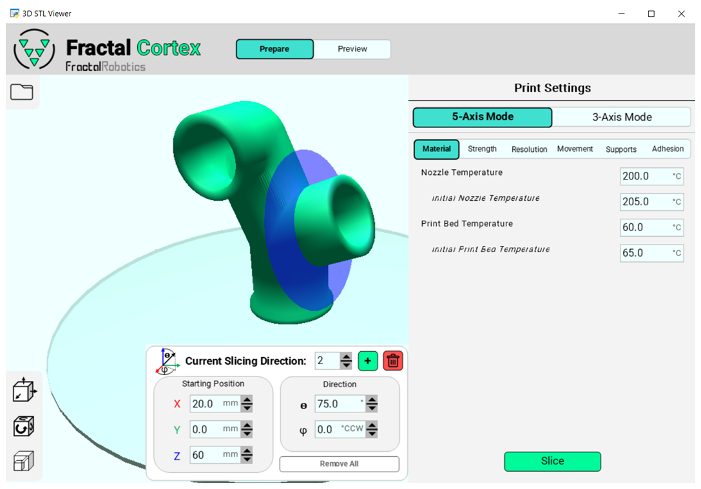

# Fractal Cortex（中文）


Fractal Cortex 是由 **Fractal Robotics** 开发的开源多方向 5 轴 FDM 切片器，同时向后兼容传统 3 轴切片工作流。

- 开源 5 轴桌面级 3D 打印机与之配套，可参考其 GitHub 页面：[Fractal 5 Pro](https://github.com/fractalrobotics/Fractal-5-Pro)

<p align="center">
  
</p>

## 💻 系统要求
- **操作系统**: Windows 10（其他平台可自行尝试）
- **Python**: 3.10.11
- **依赖库**:
  - glooey 0.3.6
  - numpy 1.26.4
  - numpy-stl 3.1.1
  - pyglet 1.5.28
  - pyOpenGL 3.1.0
  - shapely 2.0.4
  - trimesh 4.3.1

安装依赖示例：
```bash
pip install glooey==0.3.6 numpy==1.26.4 numpy-stl==3.1.1 pyglet==1.5.28 PyOpenGL==3.1.0 shapely==2.0.4 trimesh==4.3.1
```

## 📘 使用指南
Fractal Cortex 是一种“多方向 5 轴”FDM 切片方案：将 3D 模型划分为多个子体积（chunk），并对每个子体积采用不同的切片方向。与“非平面切片”不同，Fractal Cortex 更关注通过多方向分块来减少支撑使用，并保持易用性。

### 什么是多方向 5 轴切片？
- 将模型分割为多个方向一致的小体积，每个体积采用独立的切片平面与方向。
- 切片完成后导出的 G-code 会在各体积之间插入相对喷头/工件的重新定向指令。
- 与非平面切片（每层表面曲线化）相比，多方向切片更强调“方向分块”，以此降低支撑、兼顾易学易用。

<p align="center">
  
</p>

### 5 轴模式
1. 右键 `slicer_main.py`，选择 “Edit with IDLE 3.10 (64 Bit)” 打开后按 F5 运行；窗口中默认选中 “5-Axis Mode”。

<p align="center">
  
</p>

2. 点击左上角文件图标选择一个或多个 STL；在视窗中可选中模型进行平移/旋转/缩放（支持多选：CTRL 或 CTRL+A，全选后可 ESC 取消）。支持撤销（CTRL+Z）。

<p align="center">
  
</p>

3. 在右侧打印设置中指定初始“切片方向数量”。注意最小为 2（第一方向固定为与平台法向一致）。点击 Apply 后，可见蓝色切片平面与“Current Slicing Direction”菜单。

<p align="center">
  
</p>

4. 使用该菜单中的 5 个输入框，调整当前切片平面的“位置与方向（θ/φ）”。

<p align="center">
  
</p>

5. 使用 `+` 添加新平面、垃圾桶删除当前平面、或清空以回到步骤 3 的初始状态。

<p align="center">
  
</p>

6. 设置常规打印参数（喷嘴温度、层高、速度、回抽等），点击 Slice 开始切片。

   - 提醒：若检测到某切片平面可能导致“喷嘴与打印床”碰撞，切片将终止，并将该平面标红；请调整为合法位置后重试。
   - 不必担心“喷嘴与在制件”的碰撞：算法会安全排序切片方向，保证路径规划中避免自碰。

7. 切片完成后，点击顶部 “Preview” 可查看 5 轴路径预览（图示为加粗层线以强调方向变化），并可另存 G-code。

<p align="center">
  
</p>

### 3 轴模式
1. 进入 “3-Axis Mode”，选择 STL，按常规 3 轴切片的方式设置参数并切片。

<p align="center">
  
</p>

2. 切片完成后进入 “Preview” 预览并保存 G-code。

<p align="center">
  
</p>

---

## 项目动机
本项目源于 **Fractal Robotics** 的愿景：**加速机械解决方案的开发**。Fractal Cortex 致力于在“3 轴 FDM 的局限”与“现有 5 轴 FDM 的门槛”之间架起桥梁。

- **3 轴 FDM 的局限**
  - 悬垂结构需要支撑；去除支撑常会损伤工件，且浪费材料、增加时间
  - 层状沉积导致层间抗剪弱、方向性强
- **现有 5 轴 FDM 的不可及**
  - 非平面切片与高级 CAM 软件相关，学习成本高
  - 商用 5 轴打印机体积大、成本高
- **折中之道：多方向 5 轴**
  - 以“方向分块”显著降低支撑需求，同时保留类 3 轴的操作体验
  - 机械方面无需细长喷头，易实现更高速度与更少振动

最终形成两部分成果：Fractal Cortex 切片器与 [Fractal 5 Pro](https://github.com/fractalrobotics/Fractal-5-Pro) 打印机。

---

## 🔎 产品-市场契合探索
通过访谈收集需求、预算与期望，并转化为设计决策：
- **关键需求与设计映射**
  - 减少后处理风险/材料浪费 ➡️ 5 轴
  - 易维护、整洁 ➡️ FDM、可拆装热床、全尺寸门
  - 降低培训成本 ➡️ 直观的多方向切片、向后兼容 3 轴
  - 复杂几何可打印 ➡️ 适配任意 3D 几何
  - 高可靠性 ➡️ CoreXY、自动调平、刚性型材
  - 材料兼容性广 ➡️ 直驱、加热平台、全封闭
  - 大体积 ➡️ φ300mm × 250mm 高

---

## 作者的话
大家好，我是 Dan Brogan。过去三年（2022–2025）我在孵化 Fractal Robotics 的同时做兼职工作，从零构建端到端的机器人产品原型，提升沟通与创业相关能力。我希望以积极的方式用技术贡献社会，这也是 Fractal Robotics 的初衷。

目前我无法继续全职投入，因此将切片器（Fractal Cortex）与打印机（Fractal 5 Pro）一并开源，便于大家学习、拓展与贡献。我很期待社区把这项工作带向新的方向。

- 欢迎在 LinkedIn 与我联系：[Dan Brogan](https://www.linkedin.com/in/dan-brogan-442b27128/)
- 或邮件：dan@fractalrobotics.com

---

## 📝 后续工作（欢迎贡献）
当前版本可用，但要成为更稳健的产品还需要改进：
- 复杂几何导致的切片中断：需要在 `slicing_functions.py` 增强错误处理（最高优先级）
- 提升整体计算效率（已做并行化，仍有空间）
- 增加 3/5 轴的支撑生成功能
- 只保留必要设置，避免臃肿

若发现问题或改进点，欢迎反馈：dan@fractalrobotics.com

---

## 免责声明
Fractal Cortex 以开源形式“按现状”提供，不附带任何担保。使用、修改或分发本软件所产生的一切后果（包括潜在的缺陷、数据丢失或硬件问题）由使用者自行承担。

---

## 致谢
- 家人与朋友
- Innovate Newport
- RISBDC
- RIHUB
- 罗德岛创业社区

---

Copyright (C) 2025 Daniel Brogan